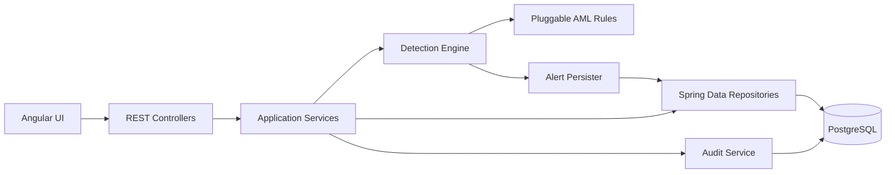

# Sentinel AML Demo Pitch

## One-Line Pitch

Sentinel AML turns raw banking transactions into explainable, risk-prioritized investigations in near real time, using an extensible Java rule engine, secure APIs, and an analyst-focused Angular workflow.

## 7-Minute Presentation

### 1. Problem and Outcome - 45 seconds

> Banks often discover suspicious transactions through delayed spreadsheet reviews. Sentinel AML replaces that reactive process with a real-time transaction-monitoring pipeline. It ingests customer, account, and transaction data, applies configurable AML rules, explains every alert, and gives analysts a complete case and audit workflow.

The prototype demonstrates the complete path:

`Ingestion -> Validation -> Currency normalization -> Detection -> Alert -> Case -> Disposition -> Audit`

### 2. Backend Architecture - 90 seconds

> The backend is built with Java 21 and Spring Boot. Its architecture is intentionally layered so that transport, business logic, and persistence can evolve independently.

- **Web layer:** versioned `/api/v1` controllers and DTOs define the external contract.
- **Service layer:** coordinates ingestion, authentication, cases, auditing, and currency conversion.
- **Detection layer:** evaluates stateless AML rules independently from HTTP and persistence concerns.
- **Repository layer:** Spring Data JPA isolates database access.
- **Database:** PostgreSQL provides relational integrity, unique deduplication constraints, and persistent audit history.
- **Schema evolution:** Flyway creates and versions the schema predictably across environments.

### 3. Ingestion and Detection - 90 seconds

> The same detection engine supports both batch and incremental ingestion. CSV upload handles demonstrations and backfills, while the transaction REST endpoint supports continuous transaction arrival.

The ingestion pipeline:

1. Parses each record.
2. Validates required fields and positive amounts.
3. Enforces customer-to-account and account-to-transaction references.
4. Converts monetary values to INR using configurable exchange rates.
5. Persists valid transactions.
6. Evaluates every enabled rule.
7. Persists deduplicated alerts and immutable audit entries.

Implemented rule strategies:

| Rule | Detection behavior |
| --- | --- |
| CTR Threshold | Detects a transaction at or above the reporting threshold |
| Structuring | Detects repeated just-below-threshold transactions in 24 hours |
| Rapid Movement | Detects at least 80% of a deposit moving out within 48 hours |
| High-Risk Jurisdiction | Detects transactions involving configured risky countries |
| Behavioral Deviation | Detects daily activity above 3x the historical daily average |

> Every alert answers three analyst questions: what happened, why it is suspicious, and which transactions prove it.

### 4. Design Principles and Patterns - 2 minutes

#### Strategy Pattern

Each rule implements `DetectionRule`. `DetectionEngine` receives all implementations through Spring dependency injection and evaluates them uniformly.

**Why it matters:** adding a new typology requires a new rule class and configuration row, without adding conditionals to the engine or changing controllers.

#### Open/Closed Principle

The engine is open for new rule implementations but closed to repeated modification. Existing ingestion and alert workflows continue to work when another strategy is introduced.

#### Single Responsibility Principle

- `IngestionService` parses and validates files.
- `CurrencyService` normalizes monetary values.
- `DetectionEngine` orchestrates rule evaluation.
- `AlertPersister` owns alert persistence and deduplication.
- `CaseService` owns investigation state transitions.
- `AuditService` records immutable events.

This separation keeps changes local and makes failures easier to diagnose.

#### Dependency Inversion and Injection

Services depend on repository and rule abstractions supplied by Spring. Business logic is not responsible for constructing infrastructure dependencies.

**Why it matters:** implementations can be tested or replaced independently, and new delivery mechanisms such as Kafka can reuse the same detection engine.

#### Repository Pattern

Spring Data repositories isolate query and persistence details from services. Domain workflows use intention-revealing methods instead of embedding SQL in controllers.

#### DTO and API Envelope Patterns

Request and response DTOs prevent JPA entities from becoming the public API. Every endpoint uses a consistent `{ data, metaData, errors }` envelope, while centralized exception handling maps validation, authorization, not-found, conflict, and unexpected failures to appropriate HTTP statuses.

**Why it matters:** clients receive a stable contract even as internal entities evolve.

#### Transaction Boundary Pattern

Alert persistence uses a separate `REQUIRES_NEW` transaction. An existence check handles the common duplicate path, while a unique database constraint resolves concurrent races safely.

**Why it matters:** concurrent streams cannot create duplicate alerts for the same event window.

#### Configuration over Hardcoding

Thresholds, time windows, scores, exchange rates, and high-risk jurisdictions live in database tables or environment configuration.

**Why it matters:** compliance teams can tune behavior without rebuilding the application.

#### Defense in Depth

Angular route guards improve navigation, but Spring Security remains authoritative. JWT authentication is stateless, passwords use BCrypt, and administrator endpoints enforce roles at the API layer.

#### Audit by Design

Case and alert transitions append audit records instead of deleting history. Disposition requires a reason and records the analyst identity.

**Why it matters:** regulatory traceability is part of the workflow, not an afterthought.

### 5. Frontend - 45 seconds

> The Angular frontend is deliberately thin. It presents backend capabilities without duplicating business rules in the browser.

- Standalone, lazy-loaded feature components keep feature boundaries clear.
- Typed services isolate API access from presentation components.
- A functional HTTP interceptor attaches JWT credentials centrally.
- Route guards separate authenticated and administrator views.
- Signals manage local UI state for loading, results, and errors.
- Dashboard, alerts, cases, rules, audit, and ingestion map directly to business workflows.

### 6. Extensibility - 45 seconds

Examples of low-impact extensions:

- **New AML rule:** implement `DetectionRule`, register its configuration, and Spring discovers it automatically.
- **Kafka ingestion:** add a message adapter that maps an event to `Transaction` and invokes the existing engine.
- **New base currency:** update exchange-rate configuration without modifying detection rules.
- **Rule versioning:** extend rule configuration and preserve versions while retaining the same strategy contract.
- **External identity provider:** replace token issuance while keeping endpoint authorization policies.
- **Additional frontend view:** add a lazy route and typed service method without moving business logic into Angular.
- **Horizontal scale:** keep rule evaluation stateless and rely on database uniqueness for cross-instance deduplication.

### 7. Closing - 30 seconds

> Sentinel AML is more than a rule demo. It is a maintainable foundation for transaction monitoring: deterministic ingestion, configurable detection, explainable evidence, secure case handling, and immutable auditability. The architecture lets the system grow from CSV-based demonstration to production streaming without rewriting the core detection model.

## Live Demo Script

Use the files in `backend/demo-sample-data` on a clean database.

1. Sign in as `admin / admin123`.
2. Open **Data Ingestion**.
3. Upload `customers.csv`: show 5 inserted and 0 failed.
4. Upload `accounts.csv`: show 5 inserted and 0 failed.
5. Upload `transactions.csv`: show 11 inserted and 0 failed.
6. Open **Dashboard**: show five alerts distributed across five rule types.
7. Open **Alerts**: point out risk ordering, severity, masked customer data, and triggered rules.
8. Open one alert: show the explanation and evidence transaction IDs.
9. Create a case: show the alert move to `IN_REVIEW`.
10. Dispose the case with a reason: show the alert close without deletion.
11. Open **Audit Trail**: show the system-created alert records and analyst case actions.
12. Open **Rule Configuration**: show that thresholds and enabled states are data-driven.

## Key Demo Data

| Story | Expected alert | Score |
| --- | --- | ---: |
| Maya Kapoor changes from INR 1,000 baseline days to INR 5,000 | Behavioral Deviation | 76 |
| Rohan Mehta performs three INR 9,000-9,999 cash transactions | Structuring | 85 |
| Sara Iyer moves INR 6,500 after an INR 8,000 credit | Rapid Movement | 80 |
| Arjun Patel transacts with a counterparty in Iran | High-Risk Jurisdiction | 75 |
| Neha Das makes an INR 15,000 transaction | CTR Threshold | 60 |

## Likely Questions

### How do you add a sixth rule?

Create a stateless class implementing `DetectionRule`, give it a stable code, and add a `rule_config` row. Spring injects it into the engine automatically; ingestion and alert persistence remain unchanged.

### How are duplicate alerts prevented?

Each rule creates a deterministic deduplication key. `AlertPersister` checks for the key, and PostgreSQL also enforces a unique constraint to handle concurrent races.

### Why keep rule configuration in the database?

Compliance thresholds change more frequently than software releases. Database-backed configuration allows controlled tuning and toggling without redeployment.

### What happens when one CSV row is invalid?

The row is rejected and reported with an error while processing continues for other rows. Referential checks prevent orphan accounts and transactions.

### Is authorization only implemented in the UI?

No. The backend enforces JWT authentication and roles through Spring Security. Frontend guards are for user experience, not the security boundary.

### How does the system support real-time processing?

`POST /api/v1/transactions` persists and evaluates one transaction synchronously. A future Kafka adapter can invoke the same stateless engine without changing rule implementations.

### Why PostgreSQL instead of H2 for the demo?

PostgreSQL preserves transactions, alerts, cases, and audits across restarts and demonstrates the intended production database. H2 remains useful for disposable local runs.

## Honest Scope

This is a hackathon prototype. Production evolution should add broader automated test coverage, secret management, database-backed rule version history, observability, rate limiting, resilient event streaming, and measured high-volume performance tests.
