# Sentinel AML

Real-time anti-money-laundering monitoring with an Angular 22 frontend, Spring Boot API, configurable detection rules, case management, and audit history.

## Requirements

- Java 21 exactly
- Node.js 22.12+ or 24
- npm 11

The Maven Wrapper is included. Verify Java with `java --version`; other Java versions are rejected by the build.

On macOS with Homebrew, select Java 21 if needed:

```bash
export JAVA_HOME="$(brew --prefix openjdk@21)/libexec/openjdk.jdk/Contents/Home"
export PATH="$JAVA_HOME/bin:$PATH"
```

## Run Locally

The default profile uses an in-memory H2 database and requires no database setup.

**Terminal 1 - backend:**

```bash
cd backend
./mvnw spring-boot:run
```

Windows: run `mvnw.cmd spring-boot:run`. Wait for `Started SentinelApplication`.

**Terminal 2 - frontend:**

```bash
cd frontend
npm ci
npm start
```

Open <http://localhost:4200> and sign in:

| Role | Username | Password |
| --- | --- | --- |
| Analyst | `analyst` | `analyst123` |
| Administrator | `admin` | `admin123` |

## Load Demo Data

Sign in as `admin`, open **Data Ingestion**, and upload once in this order:

1. `backend/demo-sample-data/customers.csv`
2. `backend/demo-sample-data/accounts.csv`
3. `backend/demo-sample-data/transactions.csv`

A clean run inserts 5 customers, 5 accounts, and 11 transactions, producing examples of all five detection rules. H2 data resets when the backend stops.

## Application Flow

### Data and detection

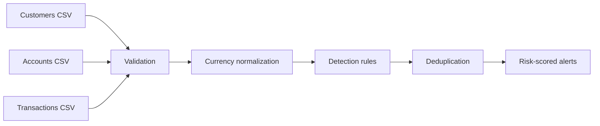

### Investigation

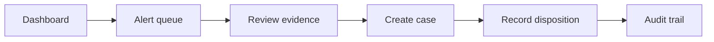

### Administration

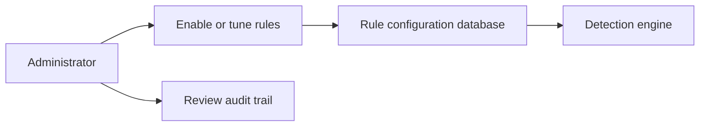

## Screenshots

### Login
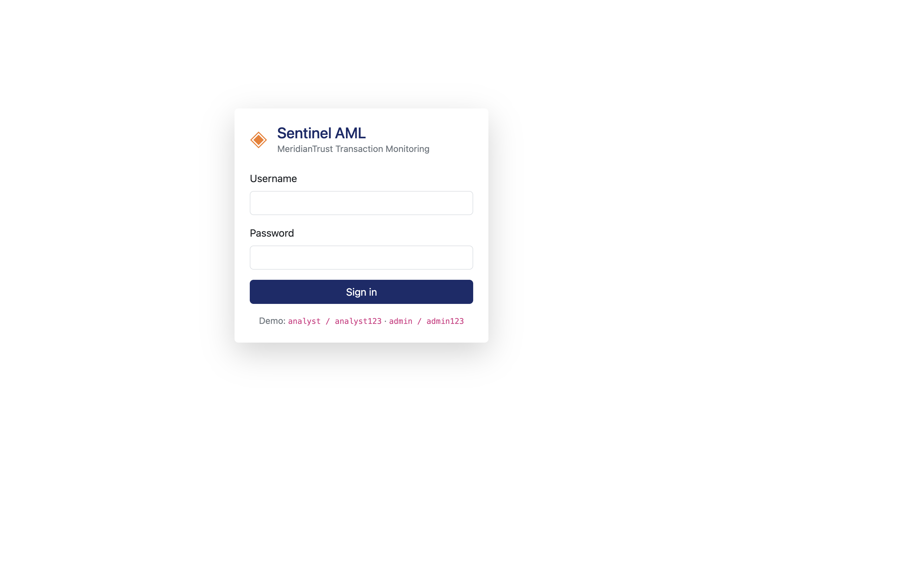

### Data ingestion
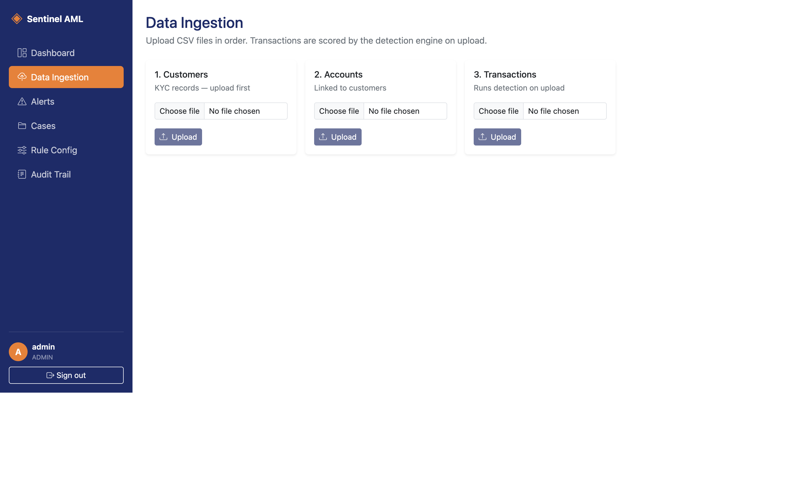

### Dashboard
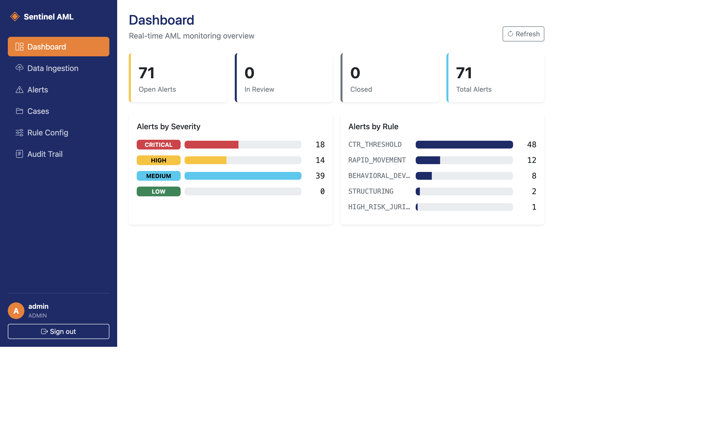

### Alert queue
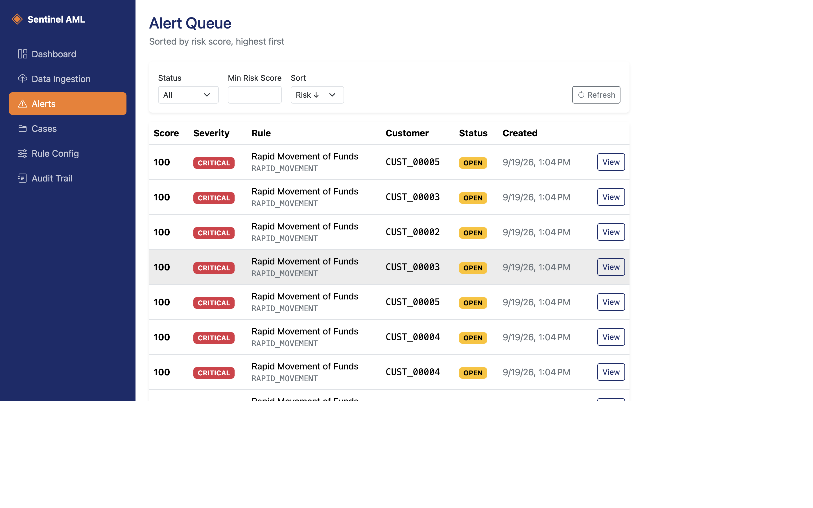

### Alert evidence
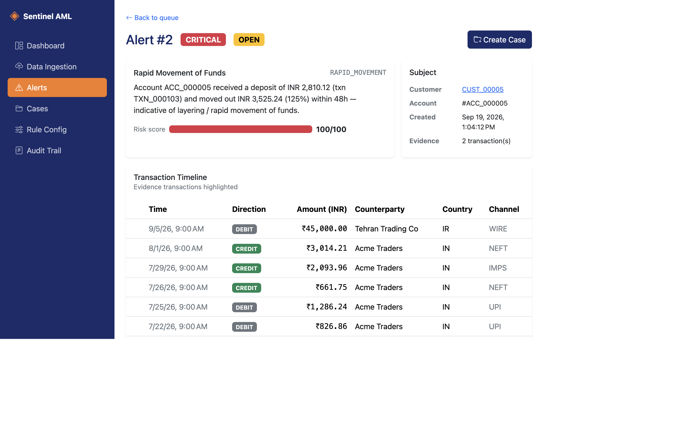

### Case workflow
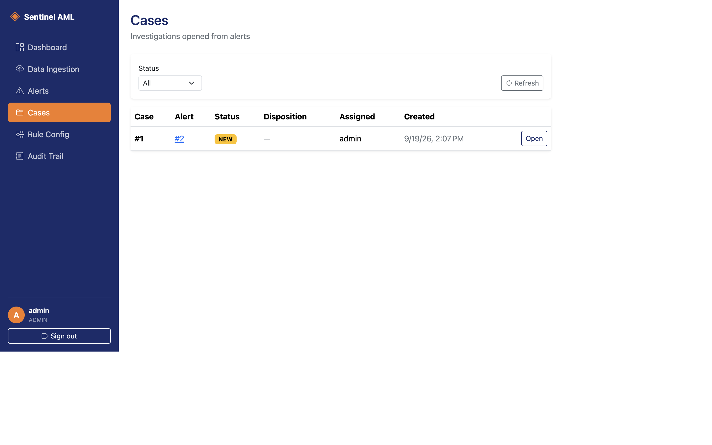
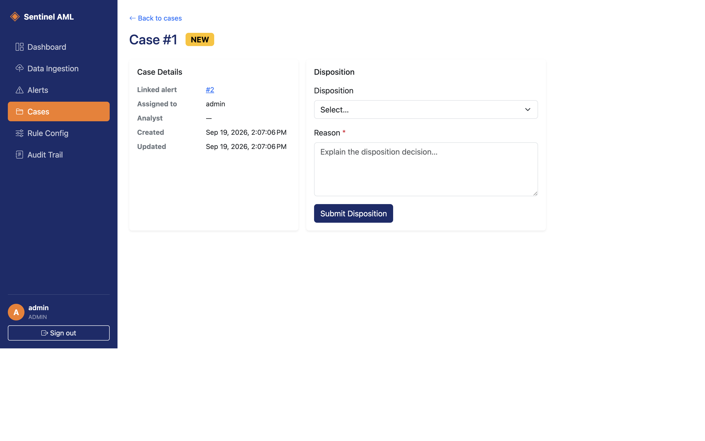

### Rule configuration
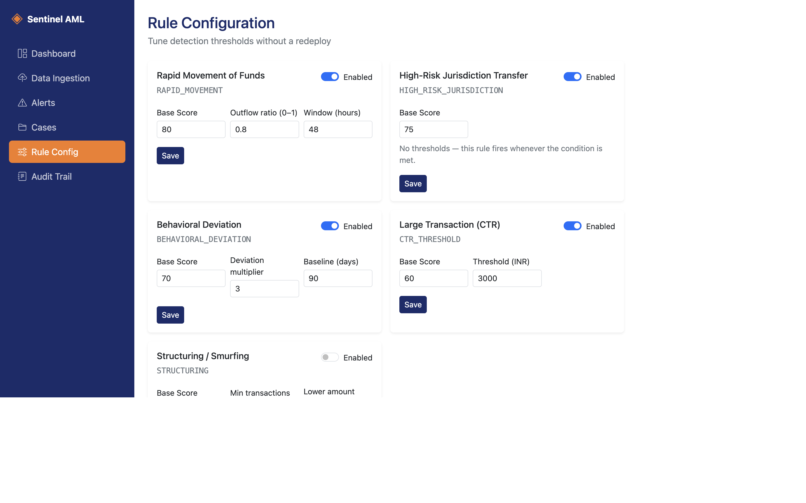

### Audit trail
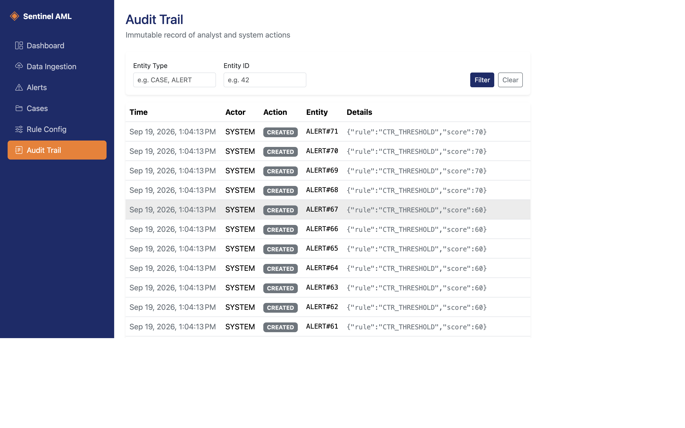

## Persistent PostgreSQL

Use PostgreSQL instead of H2 when data must survive restarts:

```bash
createdb sentinel_aml
cd backend
SPRING_PROFILES_ACTIVE=postgres \
DB_URL=jdbc:postgresql://localhost:5432/sentinel_aml \
DB_USER=postgres \
DB_PASSWORD=postgres \
./mvnw spring-boot:run
```

Replace the credentials with your local PostgreSQL user and password. Flyway creates the schema automatically; upload the demo files only once.

## Useful URLs

- Application: <http://localhost:4200>
- Swagger UI: <http://localhost:8080/swagger-ui.html>
- OpenAPI: <http://localhost:8080/v3/api-docs>
- H2 console: <http://localhost:8080/h2-console> (`jdbc:h2:mem:sentinel`, user `sa`, empty password)

## Test and Build

```bash
cd backend && ./mvnw test
cd ../frontend && npm ci && npm test -- --watch=false && npm run build
```

## Troubleshooting

- **Wrong Java:** `java --version` and `backend/mvnw --version` must report Java 21.
- **Port already used:** check with `lsof -nP -iTCP:8080 -iTCP:4200 -sTCP:LISTEN`.
- **Login fails:** verify <http://localhost:8080/v3/api-docs> opens first.
- **Duplicate CSV IDs:** restart H2 or use a new empty PostgreSQL database.
- **No alerts:** upload customers, accounts, then transactions in that order.

See [the demo walkthrough](backend/demo-sample-data/README.md) and [presentation notes](DEMO_PITCH.md).